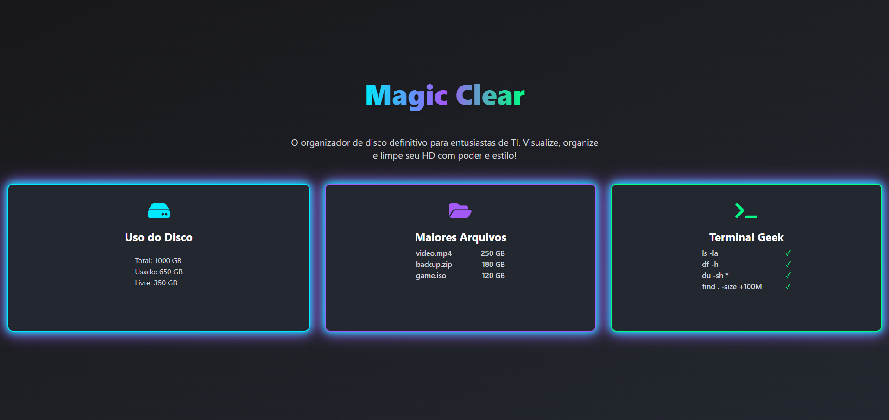
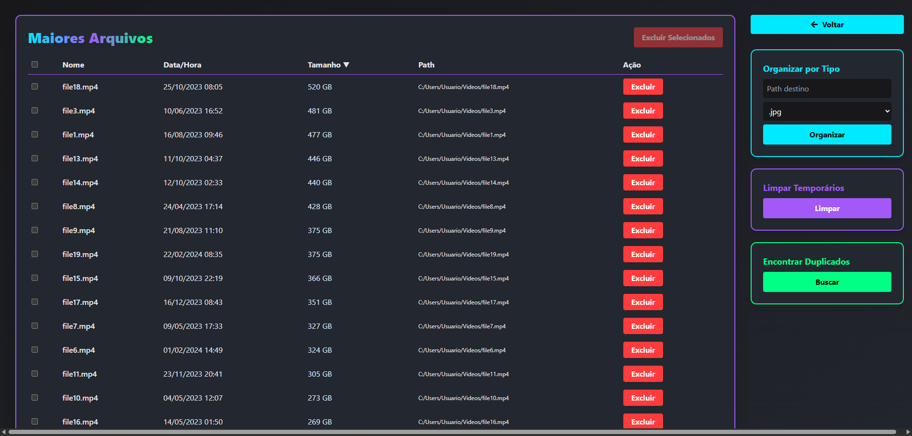
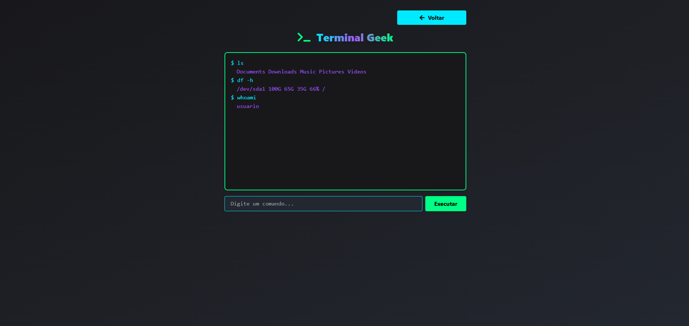

# Magic Clear

<p align="center">
  
  
  
  
  
</p>

O **Magic Clear** é um organizador de disco moderno, visual e eficiente, feito para entusiastas de TI. Visualize, organize e limpe seu HD com poder e estilo! Este projeto é o frontend da aplicação, desenvolvido com React, Vite e TypeScript, utilizando as melhores práticas de UI/UX e performance.

---

## ✨ Demonstração







---

## 🚀 Tecnologias Utilizadas

- [React 19 + TypeScript](https://react.dev/)
- [Vite](https://vitejs.dev/)
- [TailwindCSS 3](https://tailwindcss.com/)
- [Zustand](https://zustand-demo.pmnd.rs/)
- [Axios](https://axios-http.com/)
- [React Icons](https://react-icons.github.io/react-icons/)
- [Recharts](https://recharts.org/)
- [clsx](https://github.com/lukeed/clsx)
- [tsparticles](https://particles.js.org/)
- [ESLint](https://eslint.org/) + [TypeScript ESLint](https://typescript-eslint.io/)

---

## 📦 Instalação e Uso

```bash
# Instale as dependências
npm install

# Rode o projeto em modo desenvolvimento
npm run dev

# Build de produção
npm run build

# Preview do build
npm run preview

# Lint do projeto
npm run lint
```

Acesse: [http://localhost:5173/](http://localhost:5173/)

---

## 🗂️ Estrutura de Pastas

```
frontend/
  ├── public/           # Arquivos estáticos
  ├── src/
  │   ├── assets/       # Imagens e SVGs
  │   ├── components/   # Componentes reutilizáveis (crie aqui se necessário)
  │   ├── pages/        # Páginas principais (Home, Maiores Arquivos, Terminal Geek)
  │   ├── services/     # Serviços de API (mockados)
  │   ├── store/        # Zustand stores
  │   └── App.tsx      # Roteamento principal
  ├── tailwind.config.js
  ├── tsconfig*.json
  └── ...
```

---

## 🧑‍💻 Padrões e Boas Práticas

- Código modular, limpo e documentado (ES6+, TypeScript, PEP8 para backend)
- Componentização e reutilização máxima
- Responsividade e acessibilidade
- Mock de dados para simular APIs
- Uso de hooks e Zustand para estado global
- Lint e formatação automática
- Estrutura de rotas com React Router DOM
- Estilo visual moderno, com gradientes, neon e dark mode

---

## 🛠️ Scripts Disponíveis

- `npm run dev` — Inicia o servidor de desenvolvimento
- `npm run build` — Gera o build de produção
- `npm run preview` — Visualiza o build localmente
- `npm run lint` — Executa o linter

---

## 📋 Checklist de Qualidade

- [x] Estrutura modular e escalável
- [x] Responsivo e visual moderno
- [x] Mock de serviços e dados
- [x] Navegação SPA com React Router
- [x] Pronto para integração com backend

---

## 📄 Licença

Este projeto é open-source e está sob a licença MIT.

---

## 🙌 Contribuição

Sinta-se à vontade para abrir issues, sugerir melhorias ou enviar PRs!

---

## 📢 Contato

Dúvidas ou sugestões? Abra uma issue ou entre em contato pelo GitHub.
